# Сети в Linux

Настройка сетей в Linux на виртуальных машинах.

## Part 1. Инструмент **ipcalc**
**ipcalc**.

##### Определи и запиши в отчёт:
##### 1) Адрес сети *192.167.38.54/13*


##### 2) Перевод маски *255.255.255.0* в префиксную и двоичную запись:


*/15* в обычную и двоичную,


 
*11111111.11111111.11111111.11110000* в обычную и префиксную


##### 3) Минимальный и максимальный хост в сети *12.167.38.4* при масках: */8*, 


#### *11111111.11111111.00000000.00000000*


#### *255.255.254.0*


#### и */4*
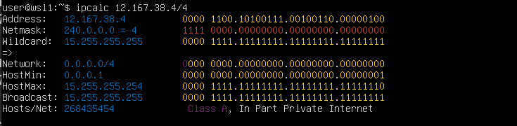


#### 1.2. localhost
##### Определим и запишим в отчёт, можно ли обратиться к приложению, работающему на localhost, со следующими IP: 
- localhost (так называемый, «местный» от англ. local, или «локальный хост», по смыслу — этот компьютер) — в компьютерных сетях, стандартное, официально зарезервированное доменное имя для частных IP-адресов (в диапазоне 127.0.0.1 — 127.255.255.254, RFC 2606). Для сети, состоящей только из одного компьютера, как правило, используется всего один адрес — 127.0.0.1, который устанавливается на специальный сетевой интерфейс «внутренней петли» (англ. loopback) в сетевом протоколе TCP/IP.
- Для определения возможности обращения к localhost используем информацию о петлевом интерфейсе (loopback), который охватывает диапазон от 127.0.0.1 до 127.255.255.255.

#### *194.34.23.100*, `нет`


#### *127.0.0.2*, `да`


#### *127.1.0.1*, `да`


#### *128.0.0.1* `нет`


#### 1.3. Диапазоны и сегменты сетей
##### Определим и запишим в отчёт:
##### 1) Какие из перечисленных IP можно использовать в качестве публичного, а какие только в качестве частных:
#### Частные:*10.0.0.45*,*192.168.4.2*, *172.20.250.4*,*172.16.255.255*, *10.10.10.10*,


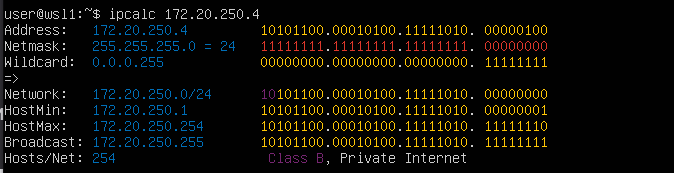

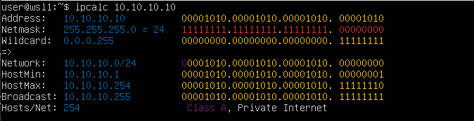


#### Публичные:
#### 134.43.0.2*,  *172.0.2.1*, *192.172.0.1*, *172.68.0.2*,  *192.169.168.1*


##### 2) Какие из перечисленных IP адресов шлюза возможны у сети *10.10.0.0/18*: *10.0.0.1*, *10.10.0.2*, *10.10.10.10*, *10.10.100.1*, *10.10.1.255*

Для определения возможных адресов шлюза в сети 10.10.0.0/18 смотрим минимальный и максимальный хост:

Минимальный хост: 10.10.0.1

Максимальный хост: 10.10.63.254
  - *10.10.0.2*, - да;
  - *10.10.10.10*, - да;
  - *10.10.1.255* - да.
  


## Part 2. Статическая маршрутизация между двумя машинами


##### Поднимим две виртуальные машины (далее -- ws1 и ws2).


##### С помощью команды `ip a` посмотрим существующие сетевые интерфейсы.


##### Опишим сетевой интерфейс, соответствующий внутренней сети, на обеих машинах и зададим следующие адреса и маски: ws1 - *192.168.100.10*, маска */16*, 

#### и выполним команду `netplan apply` для перезапуска сервиса сети:


Зададим следующий адрес и маску для ws2: - *172.24.116.8*, маска */12* 

#### выполним команду `netplan apply` для перезапуска сервиса сети:


#### 2.1. Добавление статического маршрута вручную
##### Добавим статический маршрут от одной машины до другой и обратно при помощи команды `ip r add` и пропингуем соединение между машинами:
#### Для этого сначала зайдем в настройки виртуальной машины и изменим настройки на Settings - Network - Adapter - Attached to: Internal Network


#### Для ws1:
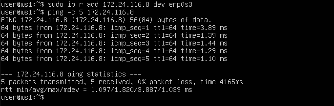

#### Для ws2:


#### 2.2. Добавление статического маршрута с сохранением
##### Перезапустим машины командой `reboot`:


##### Добавим статический маршрут от одной машины до другой с помощью файла */etc/netplan/00-installer-config.yaml* и перезепустим чтобы изменения пременились.
#### Для ws1:


#### Для ws2:


##### Пропингуем соединение между машинами.
#### Для ws1:
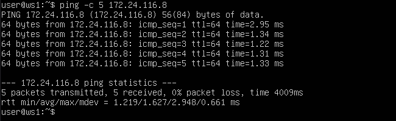
#### Для ws2:


## Part 3. Утилита **iperf3**


#### 3.1. Скорость соединения
##### Переведем и запишим размеры: 8 Mbps в MB/s, 100 MB/s в Kbps, 1 Gbps в Mbps.

- 8 Mbps - 1 MB/s;
- 100 MB/s - 800 000 Kbps;
- 1 Gbps - 1 000 Mbps

#### 3.2. Утилита **iperf3**
##### Измерим скорость соединения между ws1 и ws2.
#### Запустим ws1 в режиме сервера:


#### Запустим ws2 в режиме клиента:


## Part 4. Сетевой экран


#### 4.1. Утилита **iptables**
##### Создадим файл */etc/firewall.sh*, имитирующий фаерволл, на ws1 и ws2 и добавим в файл подряд следующие правила:
##### 1) На ws1 применим стратегию, когда в начале пишется запрещающее правило, а в конце пишется разрешающее правило (это касается пунктов 4 и 5).
##### 2) На ws2 применим стратегию, когда в начале пишется разрешающее правило, а в конце пишется запрещающее правило (это касается пунктов 4 и 5).
##### 3) Откроем на машинах доступ для порта 22 (ssh) и порта 80 (http).
##### 4) Запретим *echo reply* (машина не должна «пинговаться», т.е. должна быть блокировка на OUTPUT).
##### 5) Разрешим *echo reply* (машина должна «пинговаться»).
#### - Cкрин с содержанием файла */etc/firewall* на ws1:
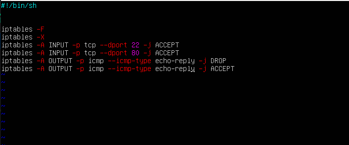 
#### На ws2:


##### Запустим файлы на обеих машинах командами `chmod +x /etc/firewall.sh` и `/etc/firewall.sh`.
Скрин с запуском файлов на ws1:


На ws2:


#### 4.2. Утилита **nmap**
##### Командой **ping** найдем машину, которая не «пингуется», после чего утилитой **nmap** покажим, что хост машины запущен.

#### Ping с ws1 на ws2:


#### Ping с ws2 на ws1:


#### *Проверяем что в выводе `nmap` сказано: `Host is up`*:


## Part 5. Статическая маршрутизация сети

Сеть:

##### Поднимим пять виртуальных машин (3 рабочие станции (ws11, ws21, ws22) и 2 роутера (r1, r2)):


#### 5.1. Настройка адресов машин
##### Настроем конфигурации машин в *etc/netplan/00-installer-config.yaml* согласно сети на рисунке.
#### ws11:


#### ws21:


#### ws22:


#### r1:


#### r2:


##### Перезапустим сервис сети командой `sudo netplan apply`.
##### Командой `ip -4 a` проверим, что адрес машины задан верно.
#### ws11:


#### ws21:


#### ws22:


#### r1:


#### r2:


#### Пропингуем ws22 с ws21.
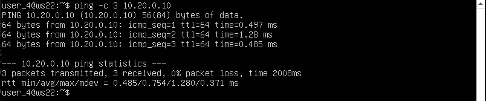

#### Аналогично пропингуем r1 с ws11.


#### 5.2. Включение переадресации IP-адресов
##### Для включения переадресации IP, выполним команду `sysctl -w net.ipv4.ip_forward=1` на роутерах:
#### r1:

#### r2:


*При таком подходе переадресация не будет работать после перезагрузки системы.*

##### Откроем файл */etc/sysctl.conf* и добавим в него следующую строку:
`net.ipv4.ip_forward = 1`
#### r1:

#### r2:


*При использовании этого подхода, IP-переадресация включена на постоянной основе.*

#### 5.3. Установка маршрута по-умолчанию
Пример вывода команды `ip r` после добавления шлюза:
```
default via 10.10.0.1 dev eth0
10.10.0.0/18 dev eth0 proto kernel scope link src 10.10.0.2
```
##### Настроем маршрут по-умолчанию (шлюз) для рабочих станций. Для этого добавим `default` перед IP роутера в файле конфигураций.
- В отчёт помести скрин с содержанием файла *etc/netplan/00-installer-config.yaml*;
#### ws11:


#### ws21:


#### ws22:


##### Вызовим `ip r` и покажим, что добавился маршрут в таблицу маршрутизации.
#### ws11:


#### ws21:


#### ws22:


##### Пропингуем ws11 и роутер r2 и покажим на r2, что пинг доходит, используя команду `tcpdump -tn -i`:
#### ws11:
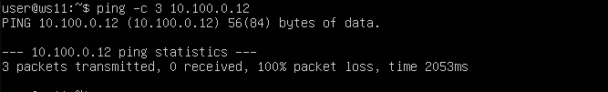

#### r2:


#### 5.4. Добавление статических маршрутов
##### Добавь в роутеры r1 и r2 статические маршруты в файле конфигураций. Пример для r1 маршрута в сетку 10.20.0.0/26:
```shell
# Добавь в конец описания сетевого интерфейса eth1:
- to: 10.20.0.0
  via: 10.100.0.12
```
- В отчёт помести скрины с содержанием изменённого файла *etc/netplan/00-installer-config.yaml* для каждого роутера.
#### r1:

#### r2:


##### Вызови `ip r` и покажи таблицы с маршрутами на обоих роутерах. Пример таблицы на r1:
```
10.100.0.0/16 dev eth1 proto kernel scope link src 10.100.0.11
10.20.0.0/26 via 10.100.0.12 dev eth1
10.10.0.0/18 dev eth0 proto kernel scope link src 10.10.0.1
```
- В отчёт помести скрин с вызовом и выводом использованной команды.
#### r1:
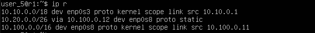
#### r2:


##### Запустим команды `ip r list 10.10.0.0/[маска сети]` и `ip r list 0.0.0.0/0` на ws11:

- В отчёт помести скрин с вызовом и выводом использованных команд;
- В отчёте объясни, почему для адреса 10.10.0.0/\[маска сети\] был выбран маршрут, отличный от 0.0.0.0/0, хотя он попадает под маршрут по-умолчанию.
#### ws11:

#### Маршрут к сети 10.10.0.0/18 был выбран не через маршрут по умолчанию 0.0.0.0/0, так как это более специфичный маршрут, и он лучше подходит для достижения указанной сети.


#### 5.5. Построение списка маршрутизаторов
Пример вывода утилиты **traceroute** после добавления шлюза:
```
1 10.10.0.1 0 ms 1 ms 0 ms
2 10.100.0.12 1 ms 0 ms 1 ms
3 10.20.0.10 12 ms 1 ms 3 ms
```
##### Запустим на r1 команду дампа `tcpdump -tnv -i eth0`:


##### При помощи утилиты **traceroute** построем список маршрутизаторов на пути от ws11 до ws21.


##### Посмотрим за изменениями на r1:


traceroute использует протокол ICMP (или UDP/TCP) для отправки пакетов с увеличивающимся значением TTL (Time-To-Live).
Каждый маршрутизатор по пути уменьшает TTL на единицу. Когда TTL достигает нуля, маршрутизатор возвращает ICMP сообщение "Time Exceeded" обратно отправителю.
traceroute записывает IP-адрес маршрутизатора, вернувшего сообщение, и время, потребовавшееся на это.
Этот процесс повторяется, пока пакет не достигнет целевого IP-адреса, позволяя traceroute собрать список всех маршрутизаторов на пути.

#### 5.6. Использование протокола **ICMP** при маршрутизации
##### Запустим на r1 перехват сетевого трафика, проходящего через eth0 с помощью команды `tcpdump -n -i eth0 icmp`:


##### Пропингуем с ws11 несуществующий IP *10.30.0.111* с помощью команды `ping -c 1 10.30.0.111`:


## Part 6. Динамическая настройка IP с помощью **DHCP**


##### Для r2 настроем в файле */etc/dhcp/dhcpd.conf* конфигурацию службы **DHCP**:
##### 1) Укажим адрес маршрутизатора по-умолчанию, DNS-сервер и адрес внутренней сети.
#### r2:


##### 2) В файле *resolv.conf* пропишим `nameserver 8.8.8.8`.


##### Перезагрузим службу **DHCP** командой `systemctl restart isc-dhcp-server`.


#### Машину ws21 перезагрузим при помощи `reboot`:


#### И через `ip a` покажим, что она получила адрес:
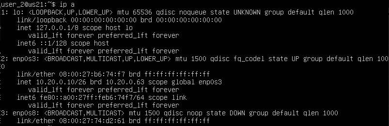

#### Также пропингуем ws22 с ws21.


##### Укажим MAC адрес у ws11, для этого в *etc/netplan/00-installer-config.yaml* надо добавить строки: `macaddress: 10:10:10:10:10:BA`, `dhcp4: true`.


##### Для r1 настроем аналогично r2, но сделаем выдачу адресов с жесткой привязкой к MAC-адресу (ws11).
#### r1:


##### 2) В файле *resolv.conf* пропишим `nameserver 8.8.8.8`.


##### Перезагрузим службу **DHCP** командой `systemctl restart isc-dhcp-server`.


#### Машину ws21 перезагрузим при помощи `reboot`:


##### Запросим с ws21 обновление ip адреса.
#### `ip` адрес до обновления:
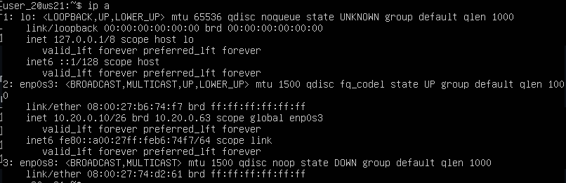

#### Принудительного освобождаем IP-адрес DHCP-клиента с помощью команды  `sudo dhclient -r`
#### Получаем новый IP-адрес с помощью DHCP с помощью команды `sudo dhclient`


#### `ip` адрес после обновления:
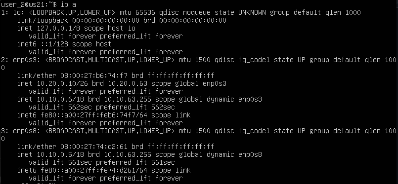

##### Запроси с ws21 обновление ip адреса.
- В отчёте помести скрины ip до и после обновления.
- В отчёте опиши, какими опциями **DHCP** сервера пользовался в данном пункте.


## Part 7. **NAT**

#### Установим Apache2 на ws22:

#### Установим Apache2 на r1:


##### В файле */etc/apache2/ports.conf* на ws22 и r1 измени строку `Listen 80` на `Listen 0.0.0.0:80`, то есть сделаем сервер Apache2 общедоступным.
#### ws22:


#### r1:


##### Запустим веб-сервер Apache командой `service apache2 start` на 
#### ws22:

#### r1:


##### Добавим в фаервол, созданный по аналогии с фаерволом из Части 4, на r2 следующие правила:
##### 1) Удаление правил в таблице filter - `iptables -F`;
##### 2) Удаление правил в таблице "NAT" - `iptables -F -t nat`;
##### 3) Отбрасывать все маршрутизируемые пакеты - `iptables --policy FORWARD DROP`.
#### r2:


##### Запустим файл также, как в Части 4.


##### Проверим соединение между ws22 и r1 командой `ping`.
#### *При запуске файла с этими правилами, ws22 не должна «пинговаться» с r1.*


##### Добавим в файл ещё одно правило:
##### 4) Разрешить маршрутизацию всех пакетов протокола **ICMP**.


##### Запустим файл также, как в Части 4.


##### Проверим соединение между ws22 и r1 командой `ping`.
#### *При запуске файла с этими правилами, ws22 должна «пинговаться» с r1.*


##### Добавим в файл ещё два правила:
##### 5) Включим **SNAT**, а именно маскирование всех локальных ip из локальной сети, находящейся за r2 (по обозначениям из Части 5 - сеть 10.20.0.0).
*Совет: стоит подумать о маршрутизации внутренних пакетов, а также внешних пакетов с установленным соединением.*
##### 6) Включим **DNAT** на 8080 порт машины r2 и добавим к веб-серверу Apache, запущенному на ws22, доступ извне сети.


##### Запустим файл также, как в Части 4.
*Перед тестированием рекомендуется отключить сетевой интерфейс **NAT** (его наличие можно проверить командой `ip a`) в VirtualBox, если он включен.*


##### Проверим соединение по TCP для **SNAT**: для этого с ws22 подключимся к серверу Apache на r1 командой`telnet [адрес] [порт]`:


##### Проверим соединение по TCP для **DNAT**: для этого с r1 подключимся к серверу Apache на ws22 командой `telnet`.


## Part 8. Дополнительно. Знакомство с **SSH Tunnels**

##### Запустим на r2 фаервол с правилами из Части 7.


##### Запустим веб-сервер **Apache** на ws22 только на localhost (то есть в файле */etc/apache2/ports.conf* измени строку `Listen 80` на `Listen localhost:80`).


##### Воспользуемся *Local TCP forwarding* с ws21 до ws22, чтобы получить доступ к веб-серверу на ws22 с ws21.


##### Воспользуемся *Remote TCP forwarding* c ws11 до ws22, чтобы получить доступ к веб-серверу на ws22 с ws11.


##### Для проверки, сработало ли подключение, перейдем во второй терминал и выполним команду `telnet 127.0.0.1 [локальный порт]`:

